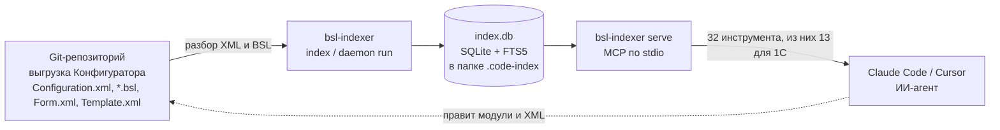
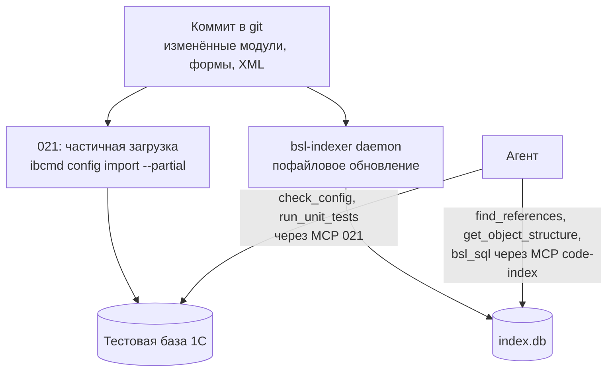

# Развёртывание bsl-indexer для разработчика 1С

Как с нуля поставить индексатор выгрузки конфигурации 1С, подключить его к своему
git-репозиторию и дать ИИ-агенту карту метаданных: ссылки, вызовы, формы, права,
запросы СКД.

> Внутренний документ команды. Содержит адрес корпоративного прокси и пути на
> рабочих машинах, поэтому в pull request автору проекта не включается.

| Замер на КА (125 107 файлов, 11,8 ГБ) | Значение |
|---|---|
| Полная индексация | 394 с |
| Размер `index.db` | 10 ГБ |
| Пик памяти при индексации | 1,5 ГБ |
| Ответ инструмента MCP | 1–30 мс |

## Содержание

1. [Что это и как устроено](#что-это-и-как-устроено)
2. [Что нужно заранее](#что-нужно-заранее)
3. [Установка бинарника](#установка-бинарника)
4. [Сборка из исходников](#сборка-из-исходников)
5. [Подключение репозитория](#подключение-репозитория)
6. [Ежедневный цикл с 021](#ежедневный-цикл-с-021)
7. [Инструменты для 1С](#инструменты-для-1с)
8. [Что индекс видит и не видит](#что-индекс-видит-и-не-видит)
9. [Диагностика](#диагностика)

## Что это и как устроено

[code-index-mcp](https://github.com/Regsorm/code-index-mcp) разбирает XML-выгрузку
Конфигуратора (или проект EDT) и модули BSL в базу SQLite, а затем отдаёт её
ИИ-агенту как набор инструментов по протоколу MCP. Сборка с поддержкой 1С называется
`bsl-indexer.exe`. Один бинарник без зависимостей, лицензия MIT, код открыт.

Агент перестаёт грепать выгрузку. Он спрашивает: кто ссылается на документ, какие у
него реквизиты и типы, какие формы и обработчики, кто пишет движения в регистр, какие
роли дают права. Ответы приходят из индекса за миллисекунды и опираются на реальную
структуру конфигурации, а не на догадки по имени.



*Схема 1. Один процесс пишет индекс, другой читает его для агента. Оба смотрят на одну
и ту же папку выгрузки.*

Индекс состоит из двух слоёв. Ядро разбирает код: функции, вызовы, полнотекстовый
поиск. Слой 1С разбирает метаданные: перечень объектов, реквизиты с типами, граф связей
данных, формы, подписки на события, права ролей, обращения к объектам из кода и из
запросов. После нашей доработки в граф входят и ссылки из описаний форм, и запросы схем
компоновки данных.

## Что нужно заранее

- **Windows x64.** Есть сборки для Linux и macOS, здесь описан Windows.
- **Репозиторий с выгрузкой.** Формат Конфигуратора: в корне индексируемой папки лежит
  `Configuration.xml`, рядом папки `Documents`, `Catalogs` и остальные. Формат EDT
  тоже поддерживается, но наши доработки по формам и СКД пока работают только для
  формата Конфигуратора.
- **Место на диске.** Индекс занимает примерно столько же, сколько сама выгрузка: у КА
  10 ГБ на 11,8 ГБ файлов. Память при индексации до 1,5 ГБ.
- **MCP-клиент.** Claude Code, Cursor или VS Code с поддержкой MCP.
- **Для сборки из исходников** дополнительно Rust и компилятор C++ из Visual Studio
  Build Tools. Для работы с готовым бинарником ничего из этого не нужно.

## Установка бинарника

Есть три пути. Первый самый быстрый, третий нужен, пока наши доработки не приняты
автором.

### Путь А. Одной командой из PowerShell

Скрипт автора скачивает нужный выпуск, распаковывает, прописывает переменную окружения,
создаёт заготовку конфига и печатает блок для файла настроек клиента.

```powershell
& ([scriptblock]::Create((irm https://raw.githubusercontent.com/Regsorm/code-index-mcp/main/install.ps1))) `
    -InstallDir "C:\Tools\code-index" `
    -Repo "ka=C:\Repo\KA\src" `
    -RegisterAutostart
```

Параметр `-Repo` сразу добавляет репозиторий под алиасом `ka`. Ключ
`-RegisterAutostart` ставит демон и MCP-сервер в автозагрузку пользователя без прав
администратора.

### Путь Б. Архив из Releases руками

На странице [Releases](https://github.com/Regsorm/code-index-mcp/releases) берётся
`bsl-indexer-windows-x64.zip`, около 10 МБ. Внутри один файл `bsl-indexer.exe`, его
кладут в папку установки, например `C:\Tools\code-index`. Проверка:

```powershell
C:\Tools\code-index\bsl-indexer.exe --version
```

### Путь В. Наша сборка с доработками

Ссылки из форм и запросы СКД есть только в нашей ветке
`feature/form-refs-and-dcs-queries`. Пока автор не принял изменения, бинарник берётся
из общей папки `C:\Rusin\tools\code-index\bsl-indexer.exe` или собирается из
исходников, как описано ниже. Версия у него та же, 1.0.1, отличить можно по строке
`data_links(form-level)` в логе индексации.

> **Прокси.** Сеть компании ходит через `vpn-proxy.primcrab.ru:10815`. Скачивание из
> PowerShell под обычным пользователем работает. Под учётной записью администратора
> пользовательский прокси не прописан, и любая загрузка падает с «Невозможно
> соединиться с удалённым сервером». Скачивайте под своей учётной записью, а под
> администратором только запускайте установщики.

## Сборка из исходников

Нужна тем, кто будет дорабатывать индексатор или собирать нашу ветку. Остальные этот
раздел пропускают.

### 1. Rust

```powershell
winget install --id Rustlang.Rustup --exact
```

Ставится toolchain `stable-x86_64-pc-windows-msvc`. Нужен Rust 1.77 или новее, сейчас
ставится 1.98.

### 2. Компилятор и линковщик MSVC

Visual Studio Build Tools 2022 с рабочей нагрузкой C++. Установщик требует прав
администратора и сети. Из неинтерактивной сессии через winget он падает, поэтому запуск
делается вручную в окне администратора. Перед этим администратору прописывается прокси:

```powershell
Set-ItemProperty 'HKCU:\Software\Microsoft\Windows\CurrentVersion\Internet Settings' -Name ProxyEnable -Value 1
Set-ItemProperty 'HKCU:\Software\Microsoft\Windows\CurrentVersion\Internet Settings' -Name ProxyServer -Value 'vpn-proxy.primcrab.ru:10815'
& C:\Rusin\tools\vs_bt\vs_BuildTools.exe --quiet --wait --norestart --add Microsoft.VisualStudio.Workload.VCTools --includeRecommended
```

Установка идёт молча 5–15 минут. Признак успеха: появилась папка
`C:\Program Files (x86)\Microsoft Visual Studio\2022\BuildTools\VC\Tools\MSVC`.

### 3. Прокси для cargo

Без этого скачивание зависимостей падает с `CRYPT_E_REVOCATION_OFFLINE`: сервер отзыва
сертификатов через прокси недоступен. Файл `%USERPROFILE%\.cargo\config.toml`:

```toml
[http]
check-revoke = false
proxy = "http://vpn-proxy.primcrab.ru:10815"

[net]
retry = 3
```

### 4. Клон, сборка, тесты

```powershell
git clone https://github.com/Regsorm/code-index-mcp.git
cd code-index-mcp
git checkout feature/form-refs-and-dcs-queries   # наша ветка, если нужна
cargo test --workspace --all-targets            # 830 тестов, около 2 минут с холодной сборкой
cargo build --release -p bsl-indexer --features enrichment
copy target\release\bsl-indexer.exe C:\Tools\code-index\
```

Первая сборка тянет зависимости около двух минут и компилирует ещё столько же.
Повторная сборка после правки укладывается в полторы минуты.

## Подключение репозитория

Дальше считаем, что бинарник лежит в `C:\Tools\code-index`, а выгрузка в
`C:\Repo\KA\src`. Подставьте свои пути.

### 1. Исключить индекс из git

Индекс живёт внутри индексируемой папки, в `.code-index\index.db`. Это гигабайты,
которые не должны попасть в коммит. В `.gitignore` репозитория:

```gitignore
# code-index-mcp: локальный индекс, не исходники
/src/.code-index/
/exts/*/.code-index/
```

### 2. Переменная CODE_INDEX_HOME

Указывает на папку установки. Там лежат бинарник, конфиг и служебные файлы демона.
Обязательна, без неё и демон, и сервер отказываются стартовать.

```powershell
setx CODE_INDEX_HOME "C:\Tools\code-index"
```

После `setx` откройте новую консоль. Альтернатива без системной переменной: передать её
в секции `env` конфигурации MCP-клиента, пример в шаге 6.

### 3. daemon.toml

Файл в папке установки перечисляет репозитории. Одна запись на конфигурацию, ещё по
одной на каждое расширение, которое хотите индексировать.

```toml
# C:\Tools\code-index\daemon.toml
[daemon]
http_port = 0            # свободный порт выберется сам

[[paths]]
path = "C:\\Repo\\KA\\src"
alias = "ka"
language = "bsl"

[[paths]]
path = "C:\\Repo\\KA\\exts\\КРБ_Тесты"
alias = "ka-tests"
language = "bsl"
```

> **Без этой строки инструментов 1С не будет.** `language = "bsl"` включает 13
> инструментов для 1С. Если запустить сервер просто с `--path` без конфига, в списке
> окажутся только универсальные инструменты поиска по коду, а `find_references` и
> `get_object_structure` ответят «tool not found».

### 4. Первая индексация

Разово, чтобы увидеть время и размер на своей конфигурации:

```powershell
bsl-indexer index C:\Repo\KA\src
```

На КА это 394 секунды при полном проходе. В логе видны фазы: перечень объектов, связи
данных, связи форм, права ролей, макеты, запросы СКД, формы, подписки, обращения в
коде, термины процедур, граф вызовов. В конце строка «завершена за … мс». Второй запуск
той же команды без изменений всё равно пересобирает служебные таблицы и занимает почти
столько же, поэтому для постоянной работы нужен демон, а не повторный `index`.

### 5. Демон

Один процесс на машину. Он делает первичную индексацию всех репозиториев из
`daemon.toml`, затем следит за файлами и обновляет индекс пофайлово: правка одного
модуля или формы доезжает за секунды, пакет из трёх тысяч файлов после `git pull` у
автора занимал 25 секунд.

```powershell
bsl-indexer daemon run        # в окне, для первого знакомства
bsl-indexer daemon status     # из другой консоли
bsl-indexer daemon reload     # после правки daemon.toml
bsl-indexer daemon stop
```

Автозапуск при входе в систему ставит либо `install.ps1 -RegisterAutostart`, либо
скрипт из репозитория:

```powershell
powershell -ExecutionPolicy Bypass -File scripts\install-daemon-autostart.ps1 `
    -BinaryPath "C:\Tools\code-index\bsl-indexer.exe" `
    -CodeIndexHome "C:\Tools\code-index" -StartNow
```

### 6. Подключение к Claude Code

Файл `.mcp.json` в корне репозитория, из которого запускается Claude Code. Сервер
читает список репозиториев из того же `daemon.toml`, поэтому алиасы совпадают с
демоном.

```json
{
  "mcpServers": {
    "code-index": {
      "command": "C:\\Tools\\code-index\\bsl-indexer.exe",
      "args": ["serve", "--transport", "stdio", "--config", "C:\\Tools\\code-index\\daemon.toml"],
      "env": { "CODE_INDEX_HOME": "C:\\Tools\\code-index" }
    }
  }
}
```

Для Cursor тот же блок кладётся в `.cursor\mcp.json` проекта. Если репозиториев
несколько, агент передаёт алиас параметром `repo` в каждом вызове; при одном
репозитории параметр можно опускать.

### 7. Проверка

Перезапустите Claude Code в этой папке и спросите агента: «покажи структуру
Document.КРБ_РазгрузкаСудна через code-index». Ответ должен прийти из
`get_object_structure` с реквизитами и типами в нотации 1С. Второй вопрос для проверки
карты влияния: «кто ссылается на AccumulationRegister.КРБ_ФрешКОтгрузке». В ответе будут
секции `data_refs`, `code_usages` и `role_rights`.

## Ежедневный цикл с 021

Индексатор не заменяет загрузку в базу, а дополняет её. Коммит из git одновременно
уезжает в тестовую базу через 021 и в индекс через демон. Агент проверяет изменения по
индексу за секунды и по базе за минуты, оба источника смотрят на один и тот же коммит.



*Схема 2. Две дороги одного коммита. База отвечает за компиляцию и тесты, индекс за
структуру и ссылки.*

Практический порядок для задачи с переименованием или правкой реквизита: сначала
`find_references` по объекту, чтобы получить полный список мест, включая чужие формы,
роли, подсистемы, запросы СКД и динамических списков. Затем правка. Затем загрузка
коммита через 021 и проверка конфигурации по изменённым объектам. Демон подхватит
правки сам, отдельной команды не нужно.

## Инструменты для 1С

Появляются в списке инструментов, когда у репозитория стоит `language = "bsl"`.
Универсальные инструменты поиска по коду работают параллельно.

| Инструмент | Что отвечает | Когда звать |
|---|---|---|
| `find_references` | Карта влияния объекта: ссылки из метаданных и форм, обращения в коде и запросах, права ролей | Перед переименованием, удалением, изменением типа |
| `get_object_structure` | Реквизиты с типами, ТЧ, измерения, ресурсы, свойства проведения, предопределённые | Перед написанием запроса или кода по объекту |
| `get_object_profile` | Паспорт объекта: структура, формы, модули, связи одним вызовом | Первое знакомство с объектом |
| `get_form_handlers` | Обработчики событий форм с привязкой к элементам | Разбор поведения формы |
| `get_data_links` | Граф связей данных в обе стороны, глубина до 4 | Трассировка «что тянет за собой» |
| `find_data_path` | Цепочка ссылок между двумя объектами | Как связаны документ и справочник |
| `get_register_writers` | Кто пишет движения в регистр, куда пишет документ | Учёт, проведение |
| `get_role_rights` | Права ролей на объект или состав прав роли | Аудит доступа |
| `get_event_subscriptions` | Подписки на события с фильтрами по источнику | Почему при записи что-то происходит |
| `find_path_bsl` | Цепочка вызовов между процедурами | Откуда вызывается функция |
| `search_terms` | Смысловой поиск процедур по словам имени, объекта, комментария | «Где реализован расчёт веса фреша» |
| `bsl_sql` | Произвольный SELECT к таблицам индекса | Всё, чего нет в готовых инструментах |

Виды обращений в `code_usages` после доработки: `manager` для `Документы.X` в коде,
`ref_type` для `"ДокументСсылка.X"` в строке, `query` для пути в тексте запроса модуля,
`dcs_query` для запроса набора данных СКД, `form_query` для ручного запроса
динамического списка. У двух последних в `file_path` стоит путь XML, а не модуля.

## Что индекс видит и не видит

| Видит | Не видит |
|---|---|
| Обращения к менеджерам, типы-ссылки в строках, пути метаданных в запросах модулей | Косвенные вызовы через `Выполнить()` и `ВычислитьВыражение()`, доступ через локальную переменную объекта |
| Типы реквизитов, ТЧ, измерений, регистраторы, состав подсистем и планов обмена, определяемые типы, функциональные опции | Имена объектов в строковых литералах, которые не являются типом или путём запроса |
| Реквизиты и параметры форм, основную таблицу и запрос динамического списка, обработчики событий | Ссылки из форм в проектах формата EDT: наша доработка разбирает только `Form.xml` Конфигуратора |
| Запросы схем компоновки данных, включая наборы-объединения | Макеты табличных документов и двоичные макеты: они исключены из индекса целиком |
| Права ролей по объектам | Ограничения RLS как смысл, только факт наличия права |

Поиск по тексту файлов (`grep_text`, `search_text`) работает только при запущенном
демоне. Структурные инструменты 1С читают `index.db` напрямую и демона не требуют.

## Диагностика

| Симптом | Причина | Что сделать |
|---|---|---|
| В списке нет `find_references`, вызов отвечает «tool not found» | Репозиторий не помечен как 1С | В `daemon.toml` добавить `language = "bsl"`, серверу передать `--config` |
| `grep_text` отвечает `daemon_offline` | Не задан `CODE_INDEX_HOME` или демон не запущен | Проверить переменную в той же сессии, запустить `daemon run` или автозапуск |
| Структурные инструменты возвращают пустые массивы | В корне индексируемой папки нет `Configuration.xml` | Указывать в `path` папку самой выгрузки, а не корень репозитория |
| Повторный `index` идёт столько же, сколько первый | Разовая команда пересобирает служебные таблицы целиком | Для постоянной работы использовать демон |
| Индекс появился в `git status` | Не исключена папка `.code-index` | Добавить её в `.gitignore` до первого коммита |
| Ответы без чужих форм и схем СКД в карте влияния | Официальный выпуск без наших доработок | Взять бинарник из нашей ветки, проверить строку `data_links(form-level)` в логе |
| `cargo build` падает на скачивании зависимостей | Проверка отзыва сертификатов через прокси | Раздел «Сборка из исходников», шаг 3 |

---

Цифры по КА сняты 4 сентября 2026 на выгрузке в 125 107 файлов. Исходники доработок:
клон `C:\Rusin\code-index-mcp`, ветка `feature/form-refs-and-dcs-queries`, два коммита
поверх v1.0.1.
